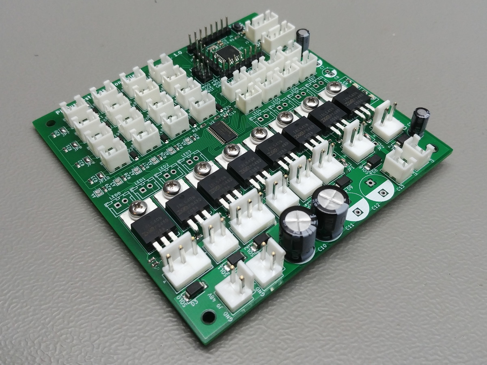

# Test-case Controller Board - Rev. 1.0

This board has been developed to control demo setups. It is essentially a smaller sized pinball machine controller. This board is based on the Arduino Uno, paired with a PCA9685 breakout board, eight MOSFETs and a four by four input matrix.

You will need to have a stencil made to make this board yourself. The SMD part footprints are not made for hand soldering.

**Warning: These designs are made as part of a hobby project and thus come with no guarantees. Do not use these designs in for any critical systems! Working with voltages higher than +40V can be potentially dangerous, please take appropriate safety measures!**

## Optional parts

 - Connectors **J2** and **J3** are optional. These headers expose the I2C bus and UART respectively.
 - Connectors **J4**, **J5**, and **J6** are optional. These headers expose the microcontroller pins.
 - Connector **J7** or **J8** are optional. These connectors are connected to the +5V rail. You will need at least one to power the board. The other connector can be used to power another board.
 - Connector **J9** or **J10** are optional. These connectors are connected to the +48V rail. You will need at least one when using the MOSFETs. The other connector can be used to power another board.
 - MOSFETs **Q1** thru **Q8** are optional:
   - Do not populate **R4**, **R6**, connector **SOL0**, and **D3** when not using **Q1**;
   - Do not populate **R8**, **R10**, connector **SOL1**, and **D4** when not using **Q2**;
   - Do not populate **R5**, **R7**, connector **SOL2**, and **D5** when not using **Q3**;
   - Do not populate **R9**, **R11**, connector **SOL3**, and **D6** when not using **Q4**;
   - Do not populate **R12**, **R14**, connector **SOL4**, and **D7** when not using **Q5**;
   - Do not populate **R16**, **R18**, connector **SOL5**, and **D8** when not using **Q6**;
   - Do not populate **R13**, **R15**, connector **SOL6**, and **D9** when not using **Q7**;
   - Do not populate **R17**, **R19**, connector **SOL7**, and **D10** when not using **Q8**;
 - When not using a MOSFET, you can use its pin on the PCA9685 to drive an LED:
   - Populate **LED0** if **Q1** is not used;
   - Populate **LED1** if **Q2** is not used;
   - Populate **LED2** if **Q3** is not used;
   - Populate **LED3** if **Q4** is not used;
   - Populate **LED4** if **Q5** is not used;
   - Populate **LED5** if **Q6** is not used;
   - Populate **LED6** if **Q7** is not used;
   - Populate **LED7** if **Q8** is not used;
 - **SOL0** and **SOL2** can be populated with either a 2 pin or a 3 pin connector:
   - Do not populate **SOL1** when **SOL0** is populated with a 3 pin connector;
   - Do not populate **SOL3** when **SOL2** is populated with a 3 pin connector;
 - All connectors and diodes making up the input matrix are optional:
   - Bridge **JP3** thru **JP6** to enable columns;
   - Bridge **JP7** thru **JP10** to enable rows;
 - Capacitors **C6** thru **C9** are optional. Populating **C6** is recommended. Populate others if needed.
 - Capacitors **C10** thru **C13** are optional. Populate if needed.

## BOM

| Identifiers                        | Quantity | Part number         | Manufacturer              | Footprint   | Description |
| ---------------------------------- | -------: | ------------------- | ------------------------- | ----------- | ----------- |
| C1                                 |       1x | CL10A475KQ8NNWC     | Samsung Electro-Mechanics | 0603        | Capacitor, MLCC, 4.7μF, 10V |
| C2, C3, C4, C5                     |       4x | GRM188R60J476ME15J  | Murata Electronics        | 0603        | Capacitor, MLCC, 47μF, 6.3V |
| C6, C7, C8, C9                     |       4x | URS1A470MDD1TA      | Nichicon                  | ⌀5mm / 2mm  | Capacitor, Electrolytic, 47μ, 10V |
| C10, C11, C12, C13                 |       4x | UVZ1J101MPD         | Nichicon                  | ⌀10mm / 5mm | Capacitor, Electrolytic, 100μF, 63V |
| C14                                |       1x | LMK107BBJ106MALT    | Taiyo Yuden               | 0603        | Capacitor, MLCC, 10μF, 10V |
| D1                                 |       1x | 150060RS75000       | Wurth Elektronik          | 0603        | LED, Red |
| D2                                 |       1x | 150060GS75000       | Wurth Elektronik          | 0603        | LED, Green |
| D3, D4, D5, D6, D7, D8, D9, D10    |       8x | S1M-13-F            | Diodes Incorporated       | SMA         | Diode, rectifier, 1A, 1000V |
| D11, D12, D13, D14, D15, D16, D17, D18, D19, D20, D21, D22, D23, D24, D25, D26 |      16x | 1N4148W-G3-08       | Vishay / Dale             | SOD-123     | Diode, general purpose, 150mA, 100V |
| J1                                 |       1x |                     |                           | 2.54mm      | Connector, 2x3, Pin header |
| J2, J3                             |       2x | B4B-XH-A(LF)(SN)    | JST                       | 2.50mm      | Connector, 1x4 |
| J4, J5                             |       2x |                     |                           | 2.54mm      | Connector, 1x8, pin header |
| J6                                 |       1x |                     |                           | 2.54mm      | Connector, 1x6, pin header |
| J7, J8, LED0, LED1, LED2, LED3, LED4, LED5, LED6, LED7, LED8, LED9, LED10, LED11, LED12, LED13, LED14, LED15, MTX-0x0, MTX-0x1, MTX-0x2, MTX-0x3, MTX-1x0, MTX-1x1, MTX-1x2, MTX-1x3, MTX-2x0, MTX-2x1, MTX-2x2, MTX-2x3, MTX-3x0, MTX-3x1, MTX-3x2, MTX-3x3 |      34x | B2B-XH-A(LF)(SN)    | JST                       | 2.50mm      | Connector, 1x2 |
| J9, J10, SOL0, SOL1, SOL2, SOL3, SOL4, SOL5, SOL6, SOL7 |      10x | B2P-VH _or_ 1-1123723-3 | JST _or_ TE Connectivity | 3.96mm      | Connector, 1x2 |
| JP1, JP2                           |       2x |                     |                           | 2.54mm      | Jumper wire |
| SOL0, SOL2                         |       2x | B3P-VH _or_ 1-1123723-2 | JST _or_ TE Connectivity | 3.96mm      | Connector, 1x3 |
| Q1, Q2, Q3, Q4, Q5, Q6, Q7, Q8     |       8x | IRL540NPBF          | Infineon / IR             | TO-220      | MOSFET, 100V, 36A |
| R1                                 |       1x | CRCW06034K70JNEAC   | Vishay / Dale             | 0603        | Resistor, 4.7kΩ |
| R2, R3                             |       2x | CRCW06031K00FKEAC   | Vishay / Dale             | 0603        | Resistor, 1kΩ |
| R4, R5, R8, R9, R12, R13, R16, R17 |       8x | CRCW060310R0FKEAC   | Vishay / Dale             | 0603        | Resistor, 10Ω |
| R6, R7, R10, R11, R14, R15, R18, R19, R20, R21, R22, R23, R24, R25, R26, R27, R28, R29, R30, R31, R32 |      21x | CRCW060310K0JNEAC   | Vishay / Dale             | 0603        | Resistor, 10kΩ |
| SW1                                |       1x | PTS810SJM250SMTRLFS | C&K                       | -           | Switch |
| U1                                 |       1x | ATmega328P-AU       | Microchip Technology      | TQFP-32     | Microcontroller |
| U2                                 |       1x | PCA9685PW,112       | NXP Semiconductors        | TSSOP-28    | PWM driver |
| Y1                                 |       1x | CSTNE16M0V53L00ZR0  | Murata Electronics        | -           | Resonator, 16MHz, 15pF |

### Pin headers

You can use either the [JST VH series](https://www.jst-mfg.com/product/detail_e.php?series=262) pin headers or the TE Connectivity Economy Power series pin headers. These pin headers are known to fit, other 3.96mm pin pitch pin headers might also fit.

 - Order the JST SVH-21T-P1.1 crimp contacts (0.34mm² - 0.75mm²) for use with the JST pin headers
 - Order JST VHR-2N connector housing for the JST B2P-VH pin header
 - Order JST VHR-3N connector housing for the JST B3P-VH pin header
 - Order the [TE Connectivity 1123721-2](https://www.te.com/usa-en/product-1123721-2.html) crimp contacts (0.34mm² - 0.75mm²) for use with the TE Connectivity pin headers
 - Order the [TE Connectivity 1-1123722-2](https://www.te.com/usa-en/product-1-1123722-2.html) connector housing for the [TE Connectivity 1-1123723-2](https://www.te.com/usa-en/product-1-1123723-2.html) pin header
 - Order the [TE Connectivity 1-1123722-3](https://www.te.com/usa-en/product-1-1123722-3.html) connector housing for the [TE Connectivity 1-1123723-3](https://www.te.com/usa-en/product-1-1123723-3.html) pin header

## Pictures

